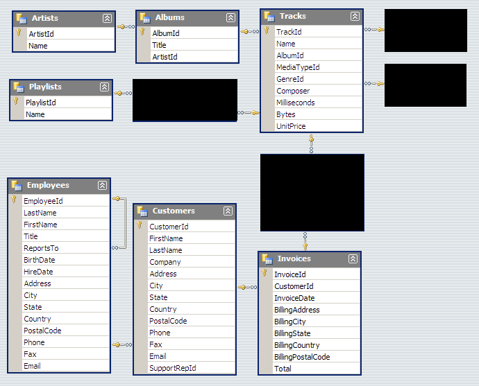

# SQL For Data Science Coursea Course

## Coding Challenges
- [Module 1](Module1.sql)
- [Module 2](Module2.sql)
- [Module 3](Module3.sql)

## Final Exam
[Data Scientist Roleplay](Data_Scienctist_Roleplay.md)

## Chinook Database
You can find the database information [here](https://www.sqlitetutorial.net/sqlite-sample-database/).
Below is the schema for the Chinook Database.
